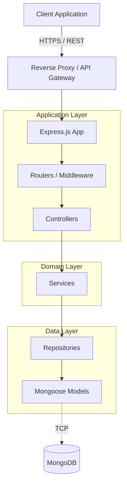
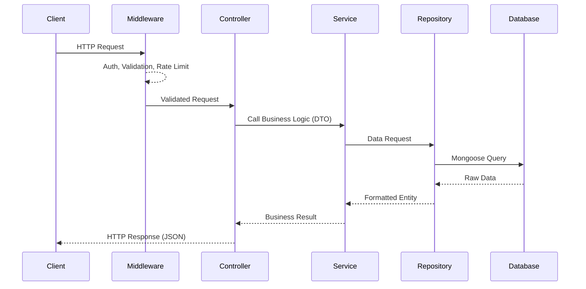
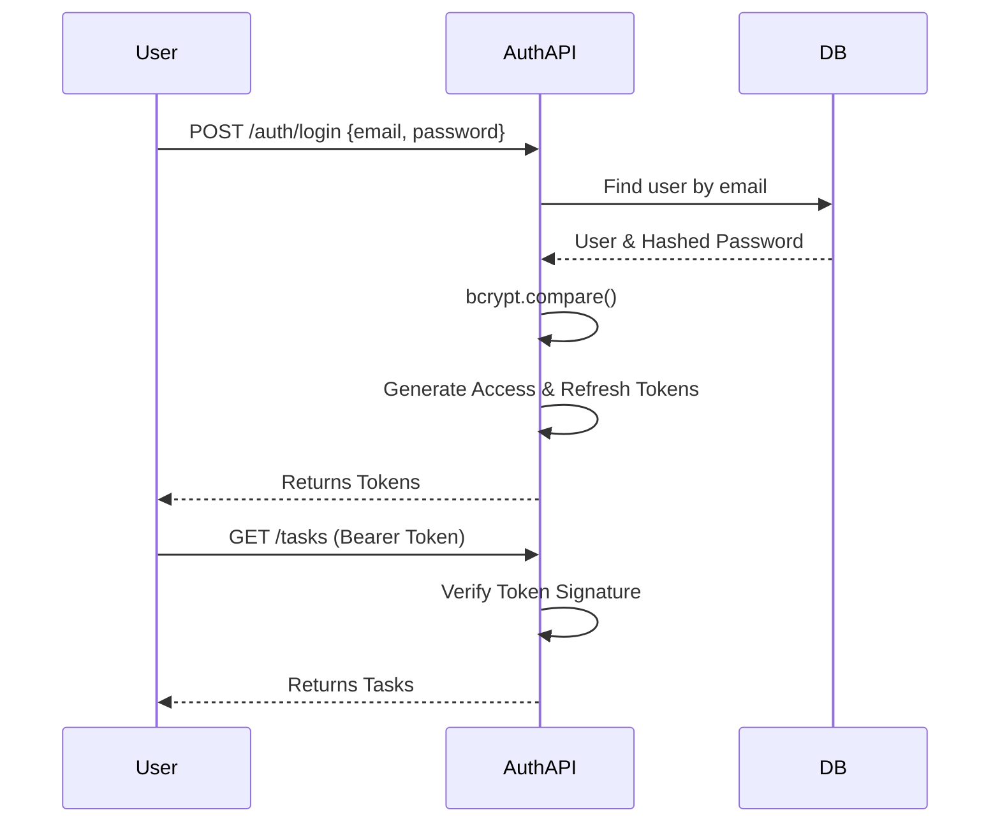

<div align="center">
  
  # 🚀 Secure Task Manager

  **A production-ready, highly decoupled REST API built with Node.js, Express, and MongoDB.**

  [](#)
  [](#)
  [](#)
  [](#)
  [](https://opensource.org/licenses/MIT)

</div>

<br />

## 📖 Project Overview

Secure Task Manager is a foundational backend service demonstrating how to build scalable, maintainable, and secure Node.js applications. 

Rather than relying on the common, tightly-coupled MVC (Model-View-Controller) pattern found in typical Node.js projects, this repository implements a strict **Modular N-Tier Architecture** (Controller -> Service -> Repository). This solves the problem of "fat controllers" and leaky abstractions, ensuring that business logic is completely decoupled from HTTP transport and database operations. It is designed to act as a robust boilerplate for startups scaling toward millions of users.

---

## ✨ Features

- ✅ **JWT Authentication**: Secure, stateless access and refresh token flows.
- ✅ **Role Based Access Control**: Strict `USER` and `ADMIN` authorization boundaries.
- ✅ **Secure Password Hashing**: Bcrypt integration with optimized cost factors.
- ✅ **Protected Routes**: Middleware verifying token validity and user existence.
- ✅ **Task CRUD**: Full lifecycle management of user tasks.
- ✅ **Pagination**: Offset-based pagination with metadata.
- ✅ **Filtering**: Dynamic query builders based on resource status and priority.
- ✅ **Searching**: MongoDB text indexing for rapid title and description search.
- ✅ **Sorting**: Multi-field ascending and descending sort capabilities.
- ✅ **Validation**: Schema-first input validation (`express-validator`).
- ✅ **Swagger**: Automated OpenAPI documentation.
- ✅ **Docker**: Multi-stage, non-root user containerization.
- ✅ **Security Middleware**: Helmet, CORS, Rate Limiting, and NoSQL Sanitization.
- ✅ **Global Error Handling**: Intercepts and transforms MongoDB errors into client-friendly responses.
- ✅ **Repository Pattern**: Abstracts all database calls away from business logic.
- ✅ **Graceful Shutdown**: Safe termination handling for `SIGTERM` signals.

---

## 🏛️ Architecture

### Overall Architecture


### Request Flow


### Authentication Flow


---

## 📂 Folder Structure

The project is organized by feature modules (Domain-Driven) rather than strictly by technical layer. This keeps related code highly cohesive.

- `src/modules/` — **The Core Domain**. Contains sub-folders for `auth`, `users`, and `tasks`. Each folder acts as a self-contained domain enclosing its own controllers, services, repositories, models, and routes.
- `src/middlewares/` — **The Gatekeepers**. Contains global and route-specific middleware such as the centralized error handler, JWT verification (`protect`), RBAC (`restrictTo`), and validation orchestrators.
- `src/config/` — **The Environment**. Houses the centralized environment variable validation script (`env.js`) ensuring the app fails-fast if misconfigured.
- `src/utils/` — **The Toolbox**. Contains shared utilities like the custom `AppError` class, `catchAsync` wrappers, and JWT sign/verify logic.
- `src/routes/` — **The Aggregator**. Mounts the various module routes into a single versioned API tree (e.g., `/v1`).

---

## 📚 API Documentation

Live interactive documentation is available via Swagger UI at `/api-docs` when running the application.

### Authentication
| Method | Endpoint | Authentication | Description |
|--------|----------|----------------|-------------|
| `POST` | `/api/v1/auth/register` | None | Register a new user |
| `POST` | `/api/v1/auth/login` | None | Authenticate user and receive tokens |
| `POST` | `/api/v1/auth/refresh` | None | Exchange a refresh token for a new access token |

### Tasks
| Method | Endpoint | Authentication | Description |
|--------|----------|----------------|-------------|
| `GET` | `/api/v1/tasks` | `Bearer` | List tasks (Supports pagination, search, sort) |
| `POST` | `/api/v1/tasks` | `Bearer` | Create a new task |
| `GET` | `/api/v1/tasks/:id` | `Bearer` | Retrieve a specific task by ID |
| `PUT` | `/api/v1/tasks/:id` | `Bearer` | Update a specific task |
| `DELETE`| `/api/v1/tasks/:id` | `Bearer` | Delete a specific task |

---

## 🔒 Security Posture

- **JWT (JSON Web Tokens)**: Cryptographically signed, stateless tokens prevent session hijacking. The dual access/refresh token pattern limits the exposure window of stolen access tokens.
- **Password Hashing**: `bcryptjs` with a cost factor of 12 is utilized in Mongoose pre-save hooks, ensuring passwords are never stored in plaintext and are computationally expensive to brute-force.
- **Helmet**: Automatically sets 14+ secure HTTP headers (e.g., `Strict-Transport-Security`, `X-Content-Type-Options`) to mitigate common web vulnerabilities.
- **Rate Limiting**: `express-rate-limit` throttles IP addresses exceeding 100 requests per 15 minutes, neutralizing automated brute-force attempts and DoS attacks.
- **Mongo Sanitization**: `express-mongo-sanitize` strips keys containing `$` and `.` from `req.body`, `req.query`, and `req.params`, completely eliminating NoSQL injection vectors.
- **Validation**: `express-validator` acts as a fail-fast mechanism. Malformed payloads are rejected with HTTP 400 before ever consuming database connection pools or CPU cycles.
- **Environment Variables**: Variables are strictly validated on boot. If `JWT_SECRET` is missing, the application crashes immediately rather than failing silently in production.

---

## 💻 Tech Stack

- **Backend**: Node.js, Express.js
- **Database**: MongoDB, Mongoose ORM
- **Security**: jsonwebtoken, bcryptjs, helmet, express-rate-limit
- **Deployment**: Docker
- **Documentation**: Swagger UI, YAML
- **Frontend (Demo)**: React, Vite, Axios, React Router

---

## 🛠️ Local Setup

1. **Clone the repository**
   ```bash
   git clone https://github.com/yourusername/secure-task-manager.git
   cd secure-task-manager/backend
   ```

2. **Install dependencies**
   ```bash
   npm install
   ```

3. **Configure Environment Variables**
   ```bash
   cp .env.example .env
   ```

4. **Start the development server**
   ```bash
   npm run dev
   ```

---

## 🐳 Docker Setup

The application includes a production-ready, multi-stage Dockerfile.

1. **Build the image**
   ```bash
   docker build -t secure-task-manager .
   ```

2. **Run the container**
   ```bash
   docker run -p 5000:5000 --env-file .env secure-task-manager
   ```

---

## ⚙️ Environment Variables

| Variable | Description | Default |
|----------|-------------|---------|
| `NODE_ENV` | Application environment (`development`, `production`) | `development` |
| `PORT` | Port the server listens on | `5000` |
| `MONGODB_URI` | Connection string for MongoDB | `mongodb://127.0.0.1:27017/secure-task-manager` |
| `JWT_SECRET` | Cryptographic key used to sign tokens | *Required* |
| `JWT_EXPIRES_IN` | Access token lifespan | `15m` |
| `JWT_REFRESH_EXPIRES_IN` | Refresh token lifespan | `7d` |

---

## 📝 API Examples

### GET /api/v1/tasks?status=PENDING&sort=-dueDate

**Response (200 OK)**
```json
{
  "status": "success",
  "meta": {
    "total": 1,
    "page": 1,
    "limit": 20
  },
  "data": {
    "tasks": [
      {
        "_id": "60d5ecb8b392d700153f3a00",
        "title": "Finalize Q3 Architecture Review",
        "description": "Review the microservices boundary plan.",
        "status": "PENDING",
        "priority": "HIGH",
        "dueDate": "2026-08-01T00:00:00.000Z",
        "owner": "60d5ec49b392d700153f39fe",
        "createdAt": "2026-07-01T12:00:00.000Z"
      }
    ]
  }
}
```

---

## 🚀 Future Improvements

While this architecture is robust, the following enhancements are planned for massive scale:
- [ ] **Integration Testing**: Implement Jest and Supertest suites for CI pipeline validation.
- [ ] **Redis Caching**: Cache frequent reads (e.g., user profiles) and implement distributed rate limiting.
- [ ] **Background Jobs**: Integrate BullMQ for asynchronous tasks (e.g., email notifications for due tasks).
- [ ] **CI/CD Pipeline**: Add GitHub Actions for automated linting, testing, and deployment.
- [ ] **Structured Logging**: Migrate from Morgan/Console to Pino for ELK/Datadog observability.

---

## 🧠 Engineering Decisions

### Why the Repository Pattern?
Tightly coupling business logic to Mongoose means that migrating to PostgreSQL (Prisma/TypeORM) in the future requires rewriting the entire application. By extracting all MongoDB queries into a `TaskRepository`, the `TaskService` only concerns itself with business rules. The Service layer is agnostic to *how* data is stored.

### Why the Service Layer?
Express Controllers should only parse HTTP requests and format HTTP responses. By moving business logic (like checking if a user has permissions to modify a task) into a Service layer, the application becomes highly testable. You can invoke the `TaskService` from a GraphQL resolver, a WebSocket event, or a cron job without altering any code.

### Why Feature-Based Architecture?
As applications scale, flat directory structures (`/controllers`, `/models`, `/services`) become navigation nightmares. Grouping by domain (e.g., `/modules/tasks`) ensures high cohesion. If the `tasks` domain needs to be extracted into a microservice later, the code is already physically separated.

---

## 📸 Screenshots

*The included React frontend serves as a functional demonstration of the API.*

| Login | Dashboard |
|-------|-----------|
|  |  |

| Swagger UI |
|-------|
|  |

---

## 🏭 Production Readiness

This project is not a tutorial. It is engineered for the realities of production:
1. **Defensive Posture**: The application assumes the network is hostile (rate limiting, NoSQL sanitization, strict validation).
2. **Fail Fast**: The application halts on boot if critical variables are missing, preventing silent production errors.
3. **Graceful Degradation**: Uncaught exceptions trigger a safe shutdown procedure that waits for active HTTP requests and database connections to close, preventing data corruption during deploys.
4. **Separation of Concerns**: The architecture is mathematically structured to allow teams to scale without stepping on each other's toes.

---

## 📄 License

This project is licensed under the MIT License - see the [LICENSE](LICENSE) file for details.
